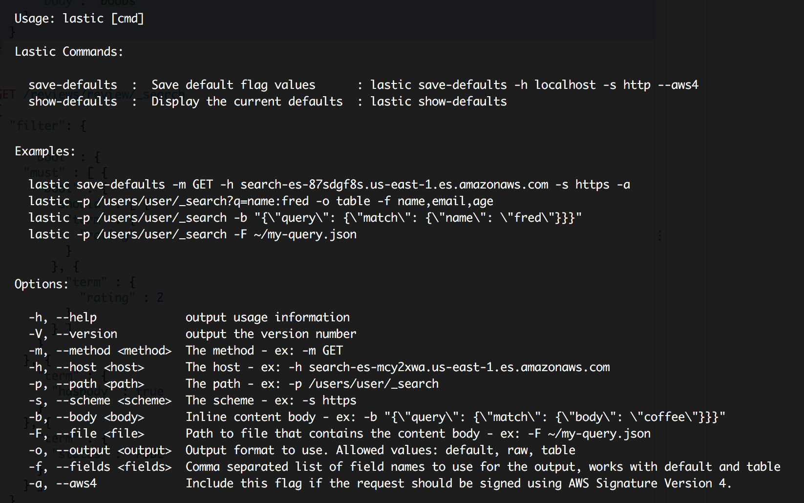

# Lastic

### A command line tool for Elasticsearch with AWS support

### What's Lastic?

Lastic is a command line tool that allows you to make Elasticsearch API calls.  

### Why does this exist?  Why not just use curl?

Lastic exists to make it easy to send curl like requests to the AWS Elasticsearch service which requires AWS Signature Version 4 to authenticate. Also, since this tool is Elasticsearch specific it includes some specific features to make working with Elasticsearch easier.

### Usage

```sh
# install it (globally)
$ npm install lastic -g

# show the help
$ lastic --help

# config it
$ lastic save-defaults -m GET -h search-es-87sdgf8s.us-east-1.es.amazonaws.com -s https -a

# use it
$ lastic -p /users/user/_search?q=name:fred -o table -f name,email,age

```

### Querying Elasticsearch

To query Elasticsearch with Lastic no command argument is required.  

``lastic -m GET -s http -h localhost:9200 -p /users/user/_search?q=name:fred``

To make your life easier, you can save the flags that don't change very often as your defaults.

``lastic save-defaults -m GET -s http -h localhost:9200``

Now you can simply execute the above query like this..

``lastic -p /users/user/_search?q=name:fred``

Lastic will use default values for any required flags that are missing.  The defaults can be modified using the command listed below.


### Commands

  - **save-defaults** : This will save default flag values to save you some typing. This is really useful for the host, method, scheme and aws4 flags.

   ``lastic save-defaults -m GET -h search-es-87sdgf8s.us-east-1.es.amazonaws.com -s https -a``
  - **show-defaults** : This will display the current default flag values.

   ``lastic show-defaults``


[](cli-help.png)

### Output format

Lastic has three output formats: default, raw and table. The output format can be specified with the ``-o`` flag. If you only wish to view a subset of the response the ``-f`` flag can be used to specify the fields to view. The fields flag only works with search results and with the default and table output formats.

 - **default**:  A simple to-string of the response data. Deeply nested objects will be truncated. Supports the ``-f`` flag.
 - **raw**:  Outputs the raw JSON response.
 - **table**:  A table view of the selected fields specified by the ``-f`` flag. Only works with search results.

*Example*

``lastic -p /users/user/_search?q=name:fred -o table -f name,email,age``


### AWS credentials

>  ***Note:***  *AWS credentials are only needed when using the ``-a`` flag.*

Lastic uses your same AWS credentials that the AWS CLI uses. It will look for your Access Key ID and Secret Access Key located at ``~/.aws/credentials``.  If you are already using the AWS CLI, then you shouldn't need to do anything additional.

You can read more about how to set this up in the [AWS CLI Getting Started Guide](http://docs.aws.amazon.com/cli/latest/userguide/cli-chap-getting-started.html)


<br/>

[](https://www.npmjs.com/package/lastic)
